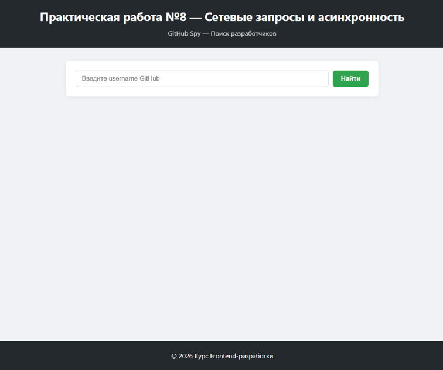
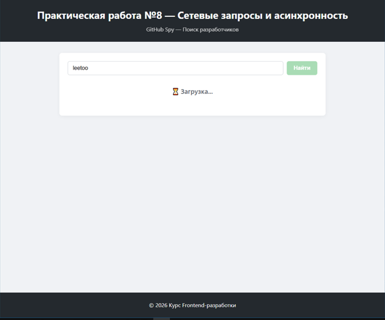
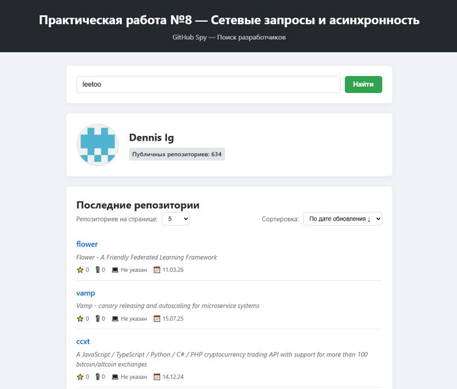
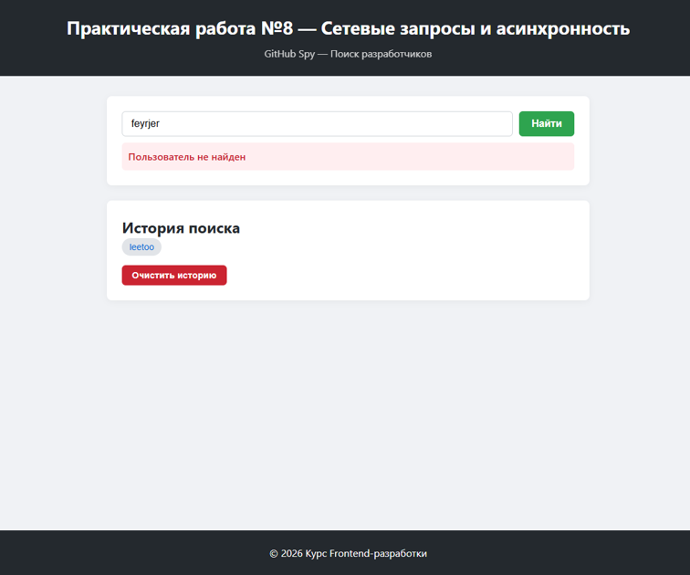
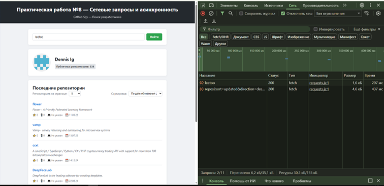

# 📋 Практическая работа №8. Тема: Сетевые запросы и асинхронность (Fetch, Promises, работа с API)

# GitHub Spy 🔍
Веб-приложение для поиска профилей пользователей на GitHub с отображением их публичных репозиториев, историей поиска и продвинутыми функциями UX.

## 📋 Содержание

- [О проекте](#о-проекте)
- [Технологии](#технологии)
- [Установка и запуск](#установка-и-запуск)
- [Структура проекта](#структура-проекта)
- [API и эндпоинты](#api-и-эндпоинты)
- [Особенности реализации](#особенности-реализации)
- [Ответы на вопросы для собеседования](#ответы-на-вопросы-для-собеседования)
- [Скриншоты](#скриншоты)

---

## 🎯 О проекте

**GitHub Spy** — это интерактивное приложение, которое демонстрирует работу с асинхронными запросами, обработку ошибок, управление состоянием загрузки и интеграцию с внешним API (GitHub API).

Проект разработан в рамках курса по JavaScript и охватывает ключевые темы:

- Работа с **Fetch API** и **Promises**
- Использование **async/await**
- Обработка ошибок сети и сервера
- Управление UX-состояниями (loading/error/success)
- Работа с **localStorage**
- Безопасная работа с DOM (без innerHTML)

---

## 🛠 Технологии

| Технология            | Назначение                                                               |
| --------------------- | ------------------------------------------------------------------------ |
| **HTML5**             | Семантическая структура страницы                                         |
| **CSS3**              | Стилизация, Flexbox, Grid, анимации (скелетон-лоадер), адаптивный дизайн |
| **JavaScript (ES6+)** | Основная логика приложения                                               |
| **Fetch API**         | Выполнение асинхронных сетевых запросов                                  |
| **GitHub API**        | Получение данных о пользователях и репозиториях                          |
| **localStorage**      | Сохранение истории поиска и настроек                                     |

---

## 🚀 Установка и запуск

1. **Клонируйте репозиторий:**
   ```bash
   git clone https://github.com/ваш-username/js-practice-08.git
   cd js-practice-08
   ```


2. **Откройте проект в VS Code:**

   ```bash
   code .
   ```

3. **Запустите через Live Server:**
   - Установите расширение **Live Server** в VS Code (если не установлено)
   - Нажмите правой кнопкой на `index.html` → **Open with Live Server**
   - Или просто откройте `index.html` в браузере

---

## 📁 Структура проекта

```
js-practice-08/
├── index.html              # HTML-разметка приложения
├── style.css               # Стили и анимации
├── script.js               # Основная логика (JavaScript)
├── tests.js               # Тес тирование утилитарных функций проекта (JavaScript)
├── README.md               # Документация (этот файл)
└── screenshots/            # Скриншоты работы приложения
    ├── 01_initial.png      # Пустая страница поиска
    ├── 02_loading.png      # Индикатор загрузки (скелетон)
    ├── 03_result.png       # Успешный поиск профиля и репо
    ├── 04_error.png        # Сообщение об ошибке (404)
    └── 05_console.png      # Вкладка Network с запросом (200)
```

---

## 🌐 API и эндпоинты

Приложение использует **GitHub REST API v3**:

| Эндпоинт                                        | Метод | Описание                              | Параметры                                                               |
| ----------------------------------------------- | ----- | ------------------------------------- | ----------------------------------------------------------------------- |
| `https://api.github.com/users/{username}`       | GET   | Получение данных профиля пользователя | `username` — никнейм GitHub                                             |
| `https://api.github.com/users/{username}/repos` | GET   | Получение списка репозиториев         | `sort` (updated/stars/name), `direction` (asc/desc), `per_page`, `page` |
| `https://api.github.com/search/users`           | GET   | Поиск пользователей (для подсказок)   | `q` (запрос), `per_page`                                                |

### Пример запроса:

```javascript
// Профиль пользователя
fetch("https://api.github.com/users/octocat");

// Репозитории с пагинацией и сортировкой
fetch(
  "https://api.github.com/users/octocat/repos?sort=updated&direction=desc&per_page=5&page=1",
);

// Поиск пользователей
fetch("https://api.github.com/search/users?q=torvalds&per_page=5");
```

---

## 💡 Особенности реализации

### 1. **Асинхронность и обработка ошибок**

- Используется `async/await` для читаемости кода
- Все запросы обёрнуты в `try/catch` для обработки сетевых ошибок
- Проверка `response.ok` перед парсингом JSON (fetch не падает при 404/500)
- Проверка `Content-Type` ответа для защиты от некорректных данных

### 2. **Безопасность**

- Запрещено использование `innerHTML` для данных от API
- Все данные вставляются через `textContent` (защита от XSS-атак)
- Использование `encodeURIComponent` для безопасной кодировки username в URL
- `rel="noopener noreferrer"` для внешних ссылок (защита от reverse tabnapping)

### 3. **Оптимизация UX**

- **Debounce 300ms** на поле ввода для снижения нагрузки на API
- **Skeleton Loader** вместо текста «Загрузка...» для лучшего восприятия
- **Минимальная задержка 700ms** для демонстрации анимации (даже при быстром ответе API)
- **Блокировка кнопки** во время запроса для предотвращения спама
- **Плавная прокрутка** к результатам поиска

### 4. **Управление состоянием**

- Состояние приложения хранится в объекте `appState`
- История поиска сохраняется в `localStorage` (ключ: `gh_search_history`)
- Корректная очистка ресурсов (AbortController для отмены устаревших запросов)

### 5. **Пагинация**

- Два режима отображения:
  - **≤10 страниц**: показываются все кнопки
  - **>10 страниц**: окно из 5 кнопок + навигация «Назад/Вперёд» + последняя страница
- Точный расчёт количества страниц на основе `totalRepos` из профиля

---

## 📚 Ответы на вопросы для собеседования

### 1. Чем async/await лучше чистых .then()?

**Ответ:**
`async/await` — это синтаксический сахар над промисами, который делает асинхронный код более читаемым и поддерживаемым:

1. **Читаемость**: Код пишется линейно, «сверху-вниз», как обычный синхронный код. Нет необходимости строить цепочки `.then()`, которые могут превратиться в «пирамиду погибели».

2. **Отладка (Debugging)**: В цепочках промисов стек вызовов часто бывает обфусцированным. С `async/await` стек ошибок понятен и указывает точное место сбоя.

3. **Обработка ошибок**: Позволяет использовать классические конструкции `try/catch` вместо привязки `.catch()` в конце каждой цепочки. Это особенно удобно при работе с несколькими асинхронными операциями.

4. **Условная логика**: С `async/await` проще писать условные конструкции (if/else, циклы), так как код выполняется последовательно.

**Пример:**

```javascript
// С .then() (сложнее читать)
getUser(username)
  .then((user) => {
    return getRepos(user.login);
  })
  .then((repos) => {
    renderRepos(repos);
  })
  .catch((error) => {
    showError(error);
  });

// С async/await (проще читать)
async function loadData() {
  try {
    const user = await getUser(username);
    const repos = await getRepos(user.login);
    renderRepos(repos);
  } catch (error) {
    showError(error);
  }
}
```

---

### 2. Почему fetch не падает в catch при ошибке 404?

**Ответ:**
Метод `fetch` отвергает промис (переходит в `catch`) **только** в случае, если запрос вообще не мог быть выполнен:

- Отсутствие интернета
- DNS-ошибка
- Блокировка CORS
- Сервер недоступен

**HTTP-ошибки** (404 Not Found, 403 Forbidden, 500 Server Error) являются **валидными ответами сервера**. Для `fetch` это означает, что сервер успешно получил запрос и ответил на него. Поэтому `fetch` считает такие ситуации успешным выполнением (`resolve`), и нам нужно **вручную** проверять свойство `response.ok` или `response.status`.

**Пример:**

```javascript
try {
  const response = await fetch("https://api.github.com/users/nonexistent");

  // fetch НЕ бросит ошибку при 404!
  // response.ok будет false, response.status будет 404

  if (!response.ok) {
    // Вот здесь мы сами обрабатываем ошибку
    throw new Error(`Ошибка: ${response.status}`);
  }

  const data = await response.json();
} catch (error) {
  // Сюда попадём только если:
  // 1. response.ok === false (мы сами бросили ошибку)
  // 2. Произошла сетевая ошибка (нет интернета)
  console.error(error);
}
```

**Аналогия из жизни:**
Представьте, что вы отправили друга (`fetch`) за бургером в Макдональдс.

- **Без проверки `response.ok`**: Друг возвращается с запиской «Бургеров нет» (404). Вы не глядя пытаетесь «съесть» записку и подавляетесь (ошибка приложения).
- **С проверкой `response.ok`**: Вы спрашиваете: «Всё ок?». Друг говорит: «Нет, бургеров нет». Вы не пытаетесь это съесть, а заказываете пиццу (переходите к обработке ошибки).

---

### 3. Зачем проверять Content-Type ответа?

**Ответ:**
Проверка заголовка `Content-Type` (например, на наличие `application/json`) необходима для **безопасности** и **стабильности** приложения:

1. **Защита от парсинга ошибок**: Если сервер по какой-то причине вернёт HTML-страницу (например, страницу ошибки прокси, 500-ю ошибку в виде HTML или страницу входа), попытка вызвать `response.json()` приведёт к падению приложения с ошибкой `SyntaxError: Unexpected token < in JSON at position 0`.

2. **Валидация данных**: Мы гарантируем, что пытаемся распарсить именно тот формат данных, который ожидаем. Это предотвращает ситуацию, когда приложение пытается работать с неверной структурой объекта.

3. **Безопасность**: Некоторые атаки могут подменять тип ответа. Проверка Content-Type — это дополнительный уровень защиты.

**Пример:**

```javascript
const response = await fetch(url);

// Проверяем, что сервер вернул JSON
const contentType = response.headers.get("Content-Type");
if (!contentType || !contentType.includes("application/json")) {
  throw new Error("Неверный формат ответа. Ожидался JSON.");
}

// Теперь безопасно парсим
const data = await response.json();
```

**Что будет без проверки:**

```javascript
// Сервер вернул HTML вместо JSON (например, страницу ошибки)
const response = await fetch(url);
const data = await response.json(); // 💥 SyntaxError! Приложение упало.
```

---

## 📸 Скриншоты

| Описание                          | Скриншот                               |
| --------------------------------- | -------------------------------------- |
| **Пустая страница поиска**        |  |
| **Индикатор загрузки (скелетон)** |  |
| **Успешный поиск профиля**        |    |
| **Сообщение об ошибке (404)**     |      |
| **Вкладка Network (200 OK)**      |  |

---


_Выполнил: Оcадчий И.А._  
_Дата: 06.04.2026_  
_Группа: 2509_